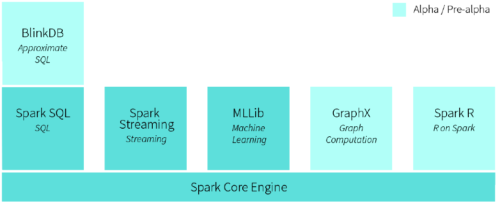
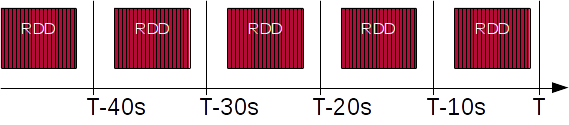
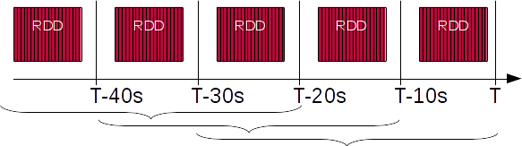
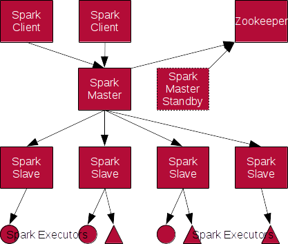
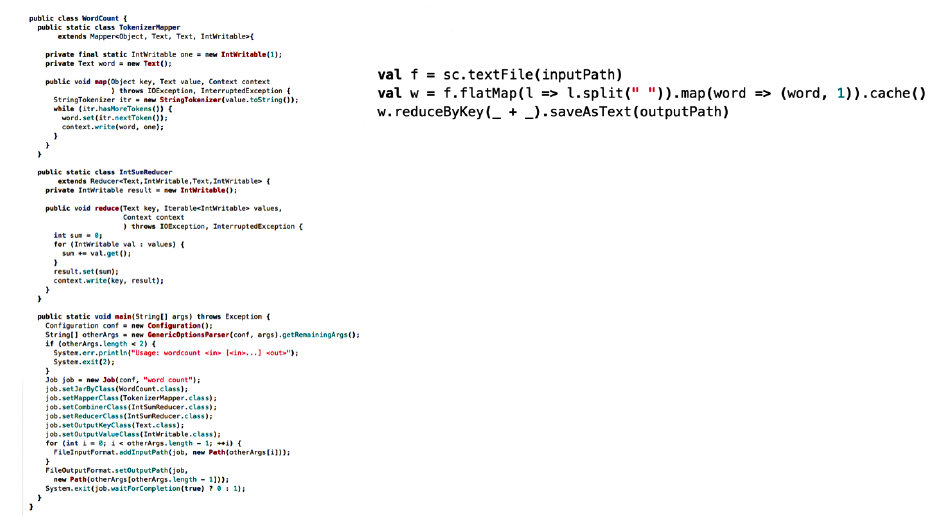
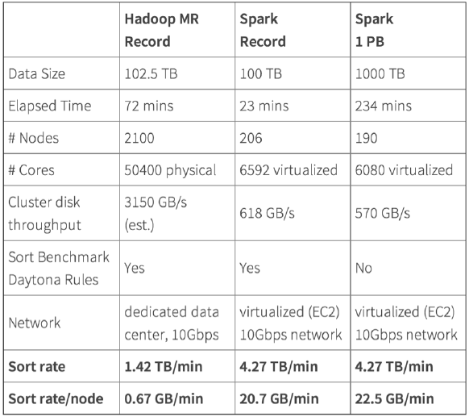
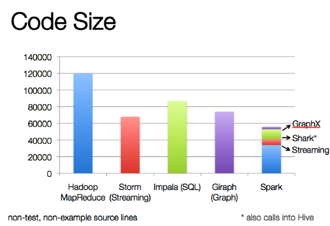

# Spark

<!-- .slide: class="page-title" -->

## RDD

* Resilient
* Distributed
* Dataset

## RDD

* Liste de partitions
* Fonction pour traiter chaque partition
* Noeuds les plus proches d'une partition
* RDDs parents

## Transformations

1 ou plusieurs RDD &rarr; 1 RDD.

Evaluation lazy

* `map`, `flatMap`, `filter`, `distinct`
* `groupBy`, `reduce`, `fold`, 
* `substract`, `intersection`, `union`, `cartesian`

## Actions

1 RDD &rarr; Donnée brute

Declenche la soumission d'un Job.

* `count`, `countByValue`, `min`, `max`
* `first`, `take`, `collect`, `foreach`
* `saveAsTextFile`, `saveAsObjectFile`

## PairRDD

Couples (clé,valeur)

* `mapValue`
* `groupByKey`, `reduceByKey`, `sortByKey`, 
* `join`, `leftOuterJoin`, `rightOuterJoin`, `cogroup`
* `partitionBy`, `coalesce`

* `saveAsSequenceFile` 

## Caching

* `cache`, `persist`
* Memoire et/ou Disque local
* Sérialisation ou pas
* Off-heap  

## Partititioning

* A la source
* Par clé + hashage

## Demo

<!-- .slide: class="page-tp1" -->

## Ecosystème Spark

## Spark SQL

* Ex-Shark

## SchemaRDD

* Table: Lignes &times; Colonnes
* Description des colonne: nom, type
   * Manuel
   * Détection (JSON, Parquet, DB)

## SQL

* `select ... from ... join ... where ... group by ... order by`
* Rule based optimizer: Catalyst 
* Compatible HiveQL?

## Spark Streaming

* Micro-batch
* *DStream*
  * Discrete Stream
  * Suite de RDD, 1 toutes les N secondes
  * Même API que Spark Core: transformations, actions

## Stream Source

* Fichiers: local, HDFS
* "Broker": Kafka, ZeroMQ, Akka
* Autre: Twitter, Socket, Flume

## Stateful Stream

* Window:
   * Détection de fraude, de tendance...

* UpdateStateByKey:
   * Maintenir un état
   * 10 articles/utilisateur
* Stateful => checkpoint

## Demo

<!-- .slide: class="page-tp2" -->

## Cluster

## Cluster manager

Standalone 

YARN

Mesos

## Demo

<!-- .slide: class="page-tp3" -->

## Hadoop

* Mêmes cas d'utilisation
* Intégration dans l'écosystème

## Plus ...

** Les slides qui suivent ne sont pas objectifs **

## Plus simple

<li>API style <em>collection</em> habituelle</li>
<li>Spark Shell</li>
<li>Spark local</li>

## Plus rapide

[Spark officially sets a new record in large-scale sorting](http://databricks.com/blog/2014/11/05/spark-officially-sets-a-new-record-in-large-scale-sorting.html)

## Plus vivant

## Plus léger

## Moins Java

## Moins répandu

Amazon, Autodesk, Baidu, eBay, Groupon, Kelkoo, NASA, Shazam, Yahoo... 

## Moins Google-friendly

  

<!-- .slide: class="page-questions" -->
