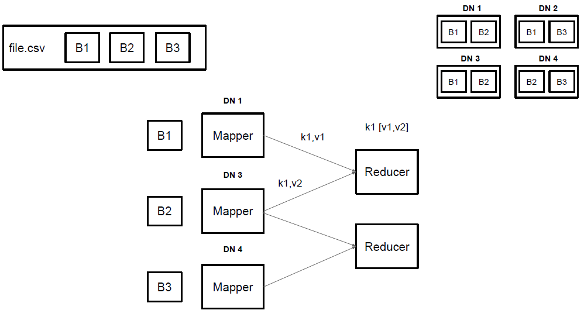
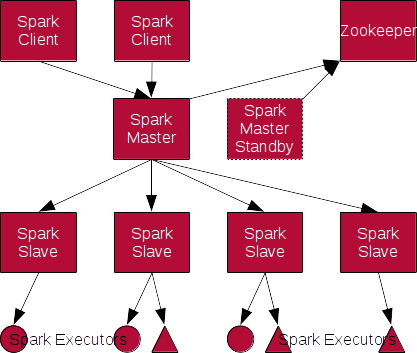

# Spark


<!-- .slide: class="page-title" -->


## Rappels Hadoop


### Ecosystème Hadoop


### Hadoop DFS


### Hadoop MapReduce




## Ecosystème Spark


## RDD

* Resilient
* Distributed
* Dataset


## RDD


## Exemple RDD

```
val error400ByIp=sc.textFile("hdfs:///access.log") // RDD[String]
  .map(l => AccessLog.parse(l))                    // RDD[AccessLog]
  .filter(l => l.httpStatus==400)                  // RDD[AccessLog]
  .keyBy(l =>  l.sourceIp)                         // RDD[String, AccessLog]
  .countByKey()                                    // Map[String, long]
```


## RDD Source

* Fichiers: Local, HDFS, S3
* Base de données: Cassandra, MongoDB, ElasticSearch, JDBC


## Transformations

1 ou plusieurs RDD &rarr; 1 RDD.

Evaluation lazy

* `map`, `flatMap`, `filter`, `distinct`
* `groupBy`, `reduce`, `fold`, 
* `substract`, `intersection`, `union`, `cartesian`


## Actions

1 RDD &rarr; Donnée brute

Declenche la soumission d'un Job.

* `count`, `countByValue`, `min`, `max`
* `first`, `take`, `collect`, `foreach`

* `saveAsTextFile`, `saveAsObjectFile`


## PairRDD

Couples (clé,valeur)

* `mapValue`
* `groupByKey`, `reduceByKey`, `sortByKey`, 
* `join`, `leftOuterJoin`, `rightOuterJoin`, `cogroup`
* `partitionBy`, `coalesce`

* `saveAsSequenceFile` 


## DAG


## Caching

* `cache`, `persist`
* Memoire et/ou Disque local
* Sérialisation ou pas
*  
    - Off-heap
    - Partagé/réutilisé entre jobs


## RDD

* Liste de partitions
* Fonction pour traiter chaque partition
* Noeuds les plus proches d'une partition
* RDDs parents


## Partitions, Tasks et Stages


## Partitioning

* A la source
* Par clé + hashage: `.partitionBy`, `coalesce`
* Shuffling: `join`, `groupByKey`, `reduceByKey`


## Demo

<!-- .slide: class="page-tp1" -->


## Cluster




## Cluster manager


Standalone 


YARN


Mesos


## Développement

* *Multi-langages:* Scala, Java, Python, R, SQL
* *Shell:* `spark-shell`, `pyspark`, `spark-sql`
* *Test:*
    - Mode local
    - De/vers les collections standards


## Connecteurs

* Standards: 
    - File, HDFS, S3, JDBC
* Extensions: 
    - Cassandra, ElasticSearch, MongoDB...
    - [spark-packages.org](http://spark-packages.org/)


## Formats

* Standards: 
    - TextFile, ObjectFile, SequenceFile (K/V), Parquet (Schema), JSON (Schema)
    - Hadoop InputFormat/OutputFormat
* Extensions: 
    - CSV, ProtoBuf, Avro, LZO, ...
    - [spark-packages.org](http://spark-packages.org/)


## Déploiement

* Packaging fat Jar (Java, Scala) ou Zip (Python)
* `spark-submit`
    - mode: client ou cluster
    - sizing executors
* Spark Job Server


## Demo

<!-- .slide: class="page-tp3" -->


## Spark SQL

* Ex-Shark


## SchemaRDD

* Table: Lignes &times; Colonnes
* Description des colonne: nom, type
   * Manuel
   * Détection (JSON, Parquet, DB)


## SQL

* `select ... from ... join ... where ... group by ... order by`
* Rule based optimizer: Catalyst 
* Push down


## HiveQL

* Syntaxe et fonctions HiveQL
* Métastore Hive (JDBC)


## Spark Streaming

* Micro-batch
* *DStream*
  * Discrete Stream
  * Suite de RDD, 1 toutes les N secondes
  * Même API que Spark Core: transformations, actions


## Stream Source

* Fichiers: local, HDFS
* "Broker": Kafka, ZeroMQ, Akka
* Autre: Twitter, Socket, Flume


## Stateful Stream

* Window:
   * Détection de fraude, de tendance...

* UpdateStateByKey:
   * Maintenir un état
   * 10 articles/utilisateur
* Stateful => checkpoint


## Demo

<!-- .slide: class="page-tp2" -->


## Hadoop

* Mêmes cas d'utilisation
* Intégration dans l'écosystème


## Plus ...

** Les slides qui suivent ne sont pas objectifs **


## Plus simple


<div style="position: relative; left:50%; top:-50%">

<li>API style <em>collection</em> habituelle</li>
<li>Spark Shell</li>
<li>Spark local</li>
</div>


## Plus rapide

[Spark officially sets a new record in large-scale sorting](http://databricks.com/blog/2014/11/05/spark-officially-sets-a-new-record-in-large-scale-sorting.html)


## Plus vivant


## Plus léger


## Moins Java


## Moins répandu

Amazon, Autodesk, Baidu, eBay, Groupon, Kelkoo, NASA, Shazam, Yahoo... 


## Moins Google-friendly

  


<!-- .slide: class="page-questions" -->
